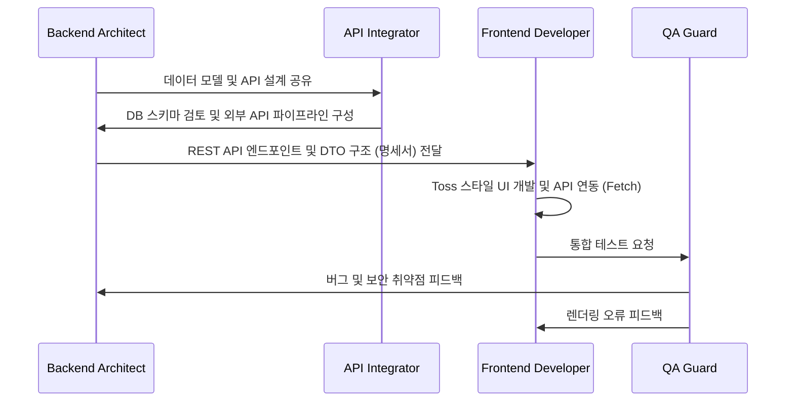

# AI Agent Team & Documentation Guideline

이 문서는 **주식 정보 제공 및 커뮤니티 플랫폼** 프로젝트를 자율적이고 완벽하게 완수하기 위해 구성된 AI 개발 팀원들의 역할과 협업 프로토콜, 그리고 개발 시 준수해야 할 문서화 가이드라인을 정의합니다.

---

## 👥 AI 개발 팀원 정의 (Roles & Responsibilities)

프로젝트 빌드를 위해 특화된 4명의 AI 에이전트를 다음과 같이 정의합니다.

### 1. ⚙️ Backend Architect (`backend-architect`)
* **역할**: 백엔드 시스템 설계, 핵심 API 개발 및 보안 아키텍처 구축
* **기술 스택**: Spring Boot 3.x, Java 21, Spring Data JPA, Spring Security, JWT
* **주요 작업 범위**:
  - 회원 관리, 게시판, 공지사항 도메인(Entity) 설계 및 REST API 구현
  - Spring Security 및 JWT 필터를 활용한 인증/인가 파이프라인 개발
  - 예외 처리 표준화 및 글로벌 예외 핸들러 구축
* **핵심 준수 사항**:
  - 객체 지향 원칙(SOLID) 및 계층형 아키텍처(Controller-Service-Repository) 엄수
  - 비즈니스 로직은 Service 레이어에서 트랜잭션 단위(`@Transactional`)로 처리

### 2. 🎨 Frontend UI/UX Developer (`frontend-developer`)
* **역할**: 사용자 중심의 웹 UI/UX 설계 및 화면 개발 (Toss 스타일 미니멀리즘)
* **기술 스택**: React 18 (Vite), Tailwind CSS v3, React Router v6
* **주요 작업 범위**:
  - 토스(Toss) 고유 디자인 요소(둥근 모서리, 여유로운 패딩, 미세 호버 애니메이션) 적용
  - 대시보드(실시간 주식 정보 및 그래프), 커뮤니티(자유게시판/공지사항), 인증(로그인/회원가입) 페이지 구현
  - Fetch API 기반의 공통 HTTP 통신 유틸리티(`api.js`) 및 JWT 자동 갱신/전송 흐름 구현
* **핵심 준수 사항**:
  - Ad-hoc 인라인 스타일을 배제하고 Tailwind CSS 테마 설정 및 유틸리티 클래스만 사용
  - 컴포넌트의 책임을 단일화하고 재사용 가능한 UI 블록으로 분리

### 3. 🔌 Data & Integration Specialist (`api-integrator`)
* **역할**: PostgreSQL DB 모델링 및 한국투자증권 API / MCP 서버 통합
* **기술 스택**: PostgreSQL, Java HTTP Clients, MCP (Model Context Protocol)
* **주요 작업 범위**:
  - PostgreSQL 테이블 스키마 정의 및 다대일(N:1) 등 관계형 모델 최적화
  - 한국투자증권 Open API 연동 및 데이터 가공 (OAuth 토큰 발급 및 실시간 호가/시세 동기화)
  - MCP 서버와의 통신 구조 및 데이터 파이프라인 설계
* **핵심 준수 사항**:
  - 민감정보(DB 계정, API Key 등)는 소스 코드 내에 하드코딩하지 않고 환경 변수나 설정 파일(`application.yml`) 템플릿을 통해 주입받도록 구성
  - 외부 API 장애 발생에 대응하는 안전한 예외 처리 및 캐싱 전략 구현

### 4. 🛡️ QA & Quality Guard (`qa-guard`)
* **역할**: 어플리케이션 검증, 보안 취약점 분석 및 API 명세 무결성 확인
* **기술 스택**: JUnit 5, Spring Security Test, Chrome Developer Tools (Lighthouse)
* **주요 작업 범위**:
  - 백엔드 회원가입/로그인 및 게시판 CRUD 단위 테스트(JUnit 5) 구현
  - CORS 설정, XSS, CSRF에 대비한 보안 정책 검토
  - 프론트엔드-백엔드 연동 단계에서의 JWT 헤더 무결성 E2E 검증
* **핵심 준수 사항**:
  - 빌드 전 테스트 코드 통과 여부를 검증하고 에러 로그 및 시스템 경고를 사전에 차단

---

## 🤝 협업 워크플로우 (Collaboration Workflow)

AI 에이전트 간의 원활한 코드 생산과 충돌 방지를 위해 다음 단계를 준수합니다.

---

## 📝 문서화 가이드라인 (Documentation Guidelines)

프로젝트 자율 개발 시 에이전트들은 다음 문서들을 **반드시** 생성하거나 최신 상태로 유지해야 합니다.

### 1. 📂 루트 README.md ([README.md](file:///d:/DK/workspace_vibe/kosmo_react_vibe/README.md))
* **목적**: 프로젝트 전반에 대한 퀵스타트 가이드
* **필수 포함 항목**:
  - 프로젝트 개요 및 토스 디자인 컨셉 소개
  - 전체 폴더 구조 및 사용 기술 맵
  - 로컬 구동 방법 (백엔드, 프론트엔드 통합 기동 절차)
  - 외부 환경 설정 가이드

### 2. ☕ Backend 문서 ([backend/README.md](file:///d:/DK/workspace_vibe/kosmo_react_vibe/backend/README.md))
* **목적**: 백엔드 개발자 및 서버 관리자용 가이드
* **필수 포함 항목**:
  - PostgreSQL 데이터베이스 셋업 및 초기화 DDL 파일 링크
  - `application.yml` 설정 방법 (DB 주소, JWT Key, 한국투자증권 API Key 입력 위치)
  - 빌드 및 실행 명령어 (`./gradlew bootRun`)

### 3. ⚛️ Frontend 문서 ([frontend/README.md](file:///d:/DK/workspace_vibe/kosmo_react_vibe/frontend/README.md))
* **목적**: 퍼블리셔 및 프론트엔드 개발자용 가이드
* **필수 포함 항목**:
  - 패키지 매니저 실행 방법 (`npm install`, `npm run dev`)
  - Tailwind CSS 커스텀 컬러 및 Pretendard 폰트 적용 설정 설명
  - 백엔드 API 프록시 구성 (`vite.config.js`) 가이드

### 4. 📑 API 명세서 ([docs/API_SPEC.md](file:///d:/DK/workspace_vibe/kosmo_react_vibe/docs/API_SPEC.md))
* **목적**: 백엔드와 프론트엔드 간의 데이터 계약서
* **필수 포함 항목**:
  - 모든 API 엔드포인트 리스트 (URI, HTTP Method)
  - 인증 필요 여부 (JWT Bearer Token 필수 여부)
  - 요청 바디(Request Body) 및 응답 바디(Response Body) JSON 예시
  - 실패 시 에러 응답 구조 및 HTTP 상태 코드 정의
