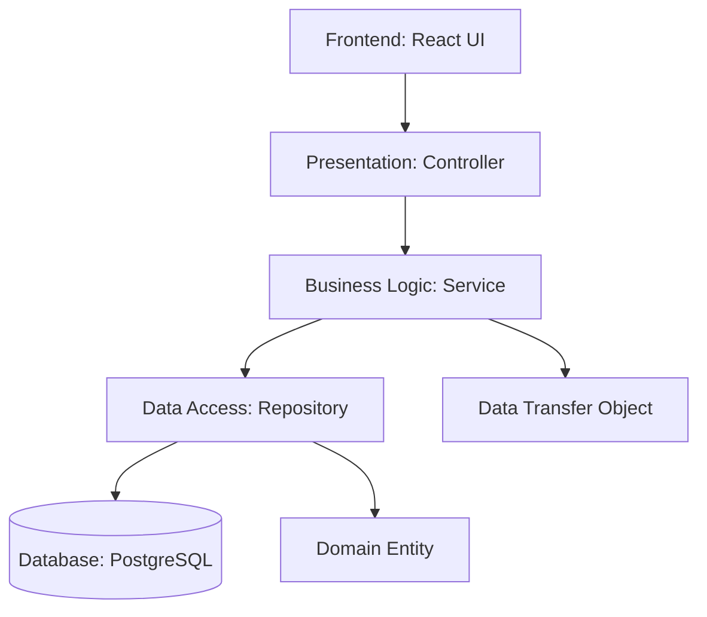

# Project Coding Convention & Architecture Standard

이 문서는 프로젝트의 지속 가능하고 유연한 기능 확장을 위해 준수해야 하는 백엔드/프론트엔드 코딩 규칙, 패키지 구조 및 데이터베이스 네이밍 컨벤션을 정의합니다.

---

## 🏗️ Layered Architecture Standard (계층형 아키텍처 규칙)

기능의 추가와 변경에 유연하게 대응할 수 있도록 비즈니스 관심사를 분리하고 의존성을 단방향으로 흐르게 설계합니다.

### 1. Presentation Layer (Controller)
* **역할**: HTTP 요청 접수, 입력값 검증(`@Valid`), API 응답 반환 및 적절한 HTTP 상태 코드 설정.
* **핵심 컨벤션**:
  - 비즈니스 로직을 직접 수행하지 않고 `Service` 인터페이스/클래스를 호출합니다.
  - 리턴 타입은 항상 `ResponseEntity<T>` 또는 일관된 공통 응답 포맷을 사용합니다.
  - 외부 노출을 제어하기 위해 데이터베이스 엔티티(Entity)를 직접 리턴하지 않고 반드시 **DTO**로 변환하여 전송합니다.

### 2. Business Layer (Service)
* **역할**: 핵심 비즈니스 규칙 및 유스케이스 구현, 데이터 트랜잭션 보장.
* **핵심 컨벤션**:
  - 로직의 성격에 맞춰 `@Transactional(readOnly = true)`를 클래스 상단에 부여하고, 쓰기 작업(CUD) 메소드에 `@Transactional`을 개별 지정합니다.
  - 외부 연동(예: 한국투자증권 API) 및 데이터 보존 책임을 가집니다.
  - 엔티티와 DTO 간의 변환을 매핑하거나 직접 수행합니다.

### 3. Data Access Layer (Repository)
* **역할**: 데이터베이스 통신 수행 및 JPA 쿼리 메소드 정의.
* **핵심 컨벤션**:
  - Spring Data JPA의 명명 규칙(Query Methods)을 충실히 따르고, 복잡한 조회 쿼리는 필요시 `@Query` 또는 QueryDSL(도입 시)을 활용합니다.

---

## ☕ Backend Code & Package Convention (Java 21 / Spring Boot 3)

### 1. 패키지 구조 (도메인 기반 플랫 구조)
프로젝트의 탐색 편의성과 고도의 응집도를 위해 최상위 패키지를 기능/도메인 단위로 분류하되, 도메인 패키지 내부에는 **하위 패키지(controller, service, repository 등)를 분리하지 않고 모든 관련 클래스를 평평하게(flat) 단일 패키지에 배치**합니다.

경로: `com.vibe.kosmo` 하위
* `[Domain 패키지]` (예: `member`, `board`, `notice`, `stock`)
  - 별도의 폴더 분할 없이 아래의 모든 클래스를 단일 도메인 패키지에 나란히 위치시킵니다.
  - *예시 (`member` 패키지 내부)*:
    - `MemberController.java`
    - `MemberService.java`
    - `MemberRepository.java`
    - `Member.java` (Entity)
    - `SignupRequest.java` (DTO)
    - `LoginRequest.java` (DTO)
* `global` (글로벌 공통 설정)
  - 공통 기술 영역(인프라)은 가독성을 위해 하위 패키지로 분류합니다.
  - `.security` : JWT 토큰 처리 필터, Provider 및 Spring Security 설정
  - `.exception` : 글로벌 예외 정의 및 `@RestControllerAdvice` 구현
  - `.config` : CORS, WebConfigurer 등 글로벌 애플리케이션 설정

### 2. 네이밍 규칙
* **클래스명**: PascalCase (예: `MemberController`, `BoardService`)
* **메소드 및 변수명**: camelCase (예: `getBoardById`, `createdAt`)
* **상수명**: UPPER_SNAKE_CASE (예: `MAX_LIMIT_COUNT`)
* **Lombok 활용**: 불필요한 보일러플레이트 제거를 위해 `@Getter`, `@Setter`, `@NoArgsConstructor`, `@AllArgsConstructor`, `@Builder`를 적절히 활용하되, JPA 엔티티 내 순환참조를 방지하기 위해 `@ToString` 및 `@EqualsAndHashCode`는 직접 구현하거나 주의하여 사용합니다.

---

## ⚛️ Frontend Code & Directory Convention (React 18 / Tailwind CSS v3)

### 1. 디렉토리 구조
경로: `frontend/src` 하위
* `/components` : 공통 및 재사용 가능한 UI 컴포넌트 (버튼, 카드, 모달 등)
* `/pages` : 라우터에 매핑되는 페이지 단위 컴포넌트 (Dashboard, Board, Login 등)
* `/hooks` : 커스텀 훅 (인증 정보 조회, API 데이터 패칭 등)
* `/utils` : 공통 헬퍼 함수 및 HTTP API 클라이언트 (`api.js`)
* `/styles` : 글로벌 CSS 파일 및 테마 스타일

### 2. 코딩 및 스타일 규칙
* **컴포넌트 선언**: `const ComponentName = () => { ... }` 화살표 함수 방식을 사용합니다.
* **파일명**: 컴포넌트 및 페이지 파일은 PascalCase 및 `.jsx` 확장자를 사용합니다 (예: `StockDashboard.jsx`). 일반 JS 파일은 camelCase를 사용합니다.
* **Tailwind CSS 가이드**:
  - 모든 여백, 폰트 크기, 배경색 등은 커스텀 테마(`tailwind.config.js`)에 맞추어 `text-toss-gray-700`, `bg-toss-blue` 형식으로 작성합니다.
  - 마우스 호버 및 액션 상태 변경은 `transition-all duration-200 hover:scale-[1.02]` 같은 부드러운 토스 스타일 마이크로 애니메이션 클래스를 결합합니다.
* **HTTP 통신**: `axios` 대신 표준 `Fetch API`를 사용하고, Authorization 헤더를 포함시키는 로직은 `utils/api.js` 공통 모듈에 중앙 집중화합니다.

---

## 💾 Database Naming Convention (PostgreSQL)

JPA DDL Auto 가 테이블을 생성하거나 마이그레이션 스크립트를 작성할 때 다음 네이밍 방침을 엄격히 준수합니다.

* **테이블 이름**: **복수형 스네이크 케이스** (Plural, snake_case)
  - 예: `members`, `boards`, `notices`, `stocks`
* **컬럼 이름**: **스네이크 케이스** (snake_case)
  - 예: `id`, `email`, `created_at`, `updated_at`, `member_id`
* **기본키(PK)**: 컬럼명은 항상 `id` 로 통일합니다.
* **외래키(FK)**: `참조테이블명_id` (단수형) 형태로 작성하여 연관관계를 명시합니다.
  - 예: `boards` 테이블이 `members` 의 PK를 가리킬 때 `member_id` 컬럼 명명.

---

## 🛡️ Security & Environment Variable Convention (보안 및 환경 변수 규칙)

소스코드의 유출이나 부주의로 인한 해킹 피해를 방지하고 외부 인프라 주입을 체계화하기 위해 다음 환경변수 규칙을 엄격히 준수합니다.

### 1. 민감 정보 하드코딩 금지
* 데이터베이스 접속 계정(URL, Username, Password), JWT Secret Key, 외부 API 인증 키(한국투자증권 AppKey, GitHub Access Token 등)는 절대 소스코드 내에 직접 문자열로 기록하지 않습니다.
* 모든 민감 정보는 프로젝트 루트 디렉토리의 `.env` 파일에 기록하여 주입받습니다.

### 2. .env 파일 커밋 절대 금지
* 프로젝트 루트의 `.env` 파일 및 개발용 로컬 환경 파일(`.env.local` 등)은 절대로 Git 원격 저장소에 업로드(Commit/Push)되어서는 안 됩니다.
* 이를 보장하기 위해 루트의 `.gitignore` 파일에 반드시 `.env` 및 관련 로컬 프로필 규칙들을 사전 등록해 둡니다.

### 3. 백엔드 및 프론트엔드 연동 방식
* **백엔드 (Spring Boot)**: `application.yml` 파일에서 스프링의 외부 구성(Property placeholder) 문법인 `${DB_URL}` 형태로 환경 변수를 바인딩합니다.
* **프론트엔드 (React / Vite)**: 필요시 `VITE_` 접두사를 붙여 프론트엔드 환경 변수명으로 매핑하고, 코드 내에서는 `import.meta.env.VITE_...` 형태로 불러와서 사용합니다.

### 4. GitHub MCP 서버 설정 연동
* 프로젝트의 외부 시스템 및 데이터 연동을 자율 수행할 수 있도록 `.agent/config.json` 내에 GitHub MCP 설정을 구성합니다.
* 이때 토큰과 같은 민감 키값은 하드코딩하지 않고, 루트 디렉토리의 `.env` 내 `GITHUB_ACCESS_TOKEN`을 간접 참조하도록 바인딩(`"GITHUB_PERSONAL_ACCESS_TOKEN": "${GITHUB_ACCESS_TOKEN}"`)하여 관리합니다.
