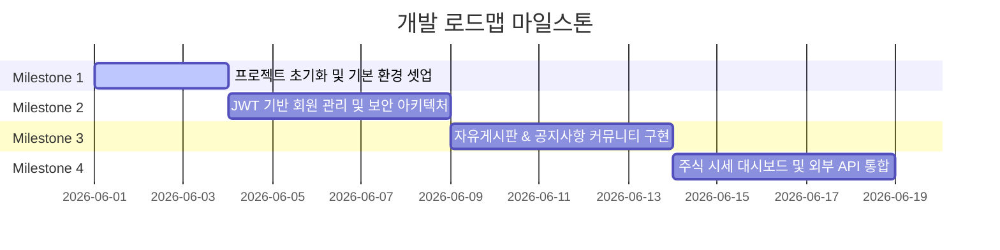

# Project Roadmap & Milestones

이 문서는 프로젝트 개발 단계를 마일스톤 별로 나눈 작업 로드맵입니다. 각 단계는 구체적인 체크리스트로 구성되어 있으며, 향후 기능 확장 요구사항을 반영할 수 있는 추가 여유 공간(Future Extensions)을 포함하고 있습니다.

---

## 📍 마일스톤 로드맵 요약

---

## 🏃 Milestone 1: 기초 셋업 & 개발 인프라 구축
> 백엔드와 프론트엔드의 프로젝트 구조를 셋업하고 빌드 오류 없이 구동 가능한 Hello World 프로젝트를 구성합니다.

- [x] **백엔드(Spring Boot 3 + Java 21) 환경 구성**
  - [x] `build.gradle` 의존성(JPA, Security, Validation, PostgreSQL, JWT) 및 Java 21 툴체인 설정
  - [x] `application.yml` 데이터베이스 커넥션 템플릿 작성 및 JPA/Hibernate DDL Auto 설정
  - [x] 패키지 구조 (`global` 하위 공통 구성 및 도메인별 플랫 패키지 배치 준비) 초기 생성
- [x] **프론트엔드(React + Vite + Tailwind CSS v3) 환경 구성**
  - [x] Vite 프로젝트 뼈대 생성 및 `tailwind.config.js` 테마 커스텀(Toss Blue, Pretendard 폰트)
  - [x] React Router Dom v6 설정 및 `App.jsx` 글로벌 라우터 바인딩
  - [x] `vite.config.js` 에 백엔드 포트(8080)용 API Proxy 설정 추가
- [x] **보안 및 외부 설정 환경 인프라 구성**
  - [x] 프로젝트 루트에 민감 정보 관리용 `.env` 템플릿 파일 생성
  - [x] 환경 변수 파일의 소스 저장소 유출 차단을 위해 `.gitignore` 규칙 등록
  - [x] 백엔드 `application.yml`에 하드코딩 배제 및 환경 변수 동적 바인딩 결합
  - [x] `.agent/config.json` 내에 `.env`와 연계된 GitHub MCP 서버 설정 연동 완료

---

## 🔑 Milestone 2: 회원 관리 및 JWT 인증 체계 구축
> 회원가입, 로그인 기능을 백엔드 보안 필터와 연결하고 프론트엔드 UI를 통해 로그인 상태를 전역적으로 유지합니다.

- [x] **Backend Security & Authentication**
  - [x] `Member` 엔티티 및 `Role` Enum (USER, ADMIN) 정의
  - [x] JWT 유틸 라이브러리 개발 (`JwtTokenProvider`) 및 인증 필터(`JwtAuthenticationFilter`) 작성
  - [x] Spring Security 6 Filter Chain 및 CORS 구체적 설정 (`SecurityConfig`)
  - [x] `POST /api/auth/signup`, `POST /api/auth/login`, `GET /api/auth/me` API 개발
- [x] **Frontend Authentication Flow**
  - [x] Fetch API 기반 공통 통신 유틸리티(`api.js`) 및 에러/토큰 가로채기(Interceptor) 로직 구성
  - [x] 토스 스타일의 간결한 회원가입 및 로그인 입력 페이지 구현
  - [x] 로컬 스토리지 또는 Context API를 이용한 로그인 사용자 상태 전역 관리 구현

---

## 💬 Milestone 3: 커뮤니티 시스템 개발 (자유게시판 & 공지사항)
> 비로그인 유저도 게시글 조회가 가능하며, 작성 및 수정 삭제는 JWT 권한 검증을 통과해야 수행할 수 있는 게시판을 만듭니다.

- [ ] **자유게시판(Board) 구현**
  - [ ] `Board` 엔티티 설계 (작성자 Member 테이블과 N:1 매핑) 및 Repository 개발
  - [ ] Board CRUD 서비스 로직 작성 및 게시글 등록/수정/삭제 시 작성자 본인 검증 로직 구현
  - [ ] Frontend: 게시글 리스트 조회, 상세 뷰어, 글쓰기/글수정 폼 디자인
- [ ] **공지사항(Notice) 구현**
  - [x] `Notice` 엔티티 설계 및 리포지토리 개발
  - [x] 공지사항 CRUD API 개발 (`POST`, `PUT`, `DELETE` 요청 시 `ROLE_ADMIN` 어드민 역할 권한 필터링 검증)
  - [x] Frontend: 공지사항 리스트 및 상세 뷰어 구현 (게시판 뷰어와 카드 스타일 통일)

---

## 📈 Milestone 4: 주식 정보 대시보드 및 실시간 연동 (한국투자증권 API & MCP)
> 금융 서비스 컨셉에 맞추어 주식 정보를 시각화하고, 외부 증권사 API 호출 구조를 연동합니다.

- [ ] **주식 시세 API 구현**
  - [ ] `StockResponse` 모델 설계 (현재가, 변동금액, 등락률, 7일 차트 역사 데이터 포함)
  - [ ] 프론트엔드 UI 렌더링에 적합하도록 주기적으로 가격이 변동하는 실시간 주식 데이터 시뮬레이션 서비스 구현
  - [ ] `GET /api/stocks` 및 `GET /api/stocks/{code}` API 개발
- [ ] **한국투자증권 Open API & MCP 연동 개발**
  - [ ] 외부 API 인증 토큰 발급 및 현재가 조회 HTTP 요청 템플릿 코드 작성
  - [ ] MCP 서버 환경과의 데이터 전송 흐름 연결 구조화
- [ ] **Toss 스타일 주식 대시보드 UI**
  - [ ] 인기 종목 순위, 급등/급락 종목 요약 화면 구현
  - [ ] Canvas/SVG 기반의 깔끔한 간이 주가 추이 선 그래프 컴포넌트 개발
  - [ ] 실시간 등락률 변화 시 깜빡임(Blink) 효과 등 마이크로 애니메이션 추가

---

## 🔮 Future Extensions & Backlog (추후 기능 추가 여유 공간)
> 비즈니스 성장 및 요구사항 변화에 따라 추가적으로 도입할 수 있는 확장 기능 저장소입니다.

- [ ] **모의 투자 거래 시스템**
  - [ ] 사용자 계정별 가상 예수금 개념 추가
  - [ ] 가상 매수/매도 주문 API 및 거래 내역 테이블 개발
- [ ] **관심 종목 스크랩 (북마크)**
  - [ ] 개별 주식 상세 화면에서 북마크 등록 기능 추가
  - [ ] 대시보드 최상단에 사용자가 스크랩한 관심 주식 리스트 노출
- [ ] **게시판 실시간 댓글 기능**
  - [ ] `Comment` 엔티티 및 CRUD API 설계
  - [ ] 자유게시판 하단에 대댓글 및 반응형 입력 폼 추가
- [ ] **실시간 푸시 알림 (WebSocket / SSE)**
  - [ ] 관심 종목 급등락 시 브라우저 내에 토스트 팝업 알림 노출
- [ ] **추가 확장 기능 1 (사용자 입력 대기)**
  - [ ] 
- [ ] **추가 확장 기능 2 (사용자 입력 대기)**
  - [ ] 
